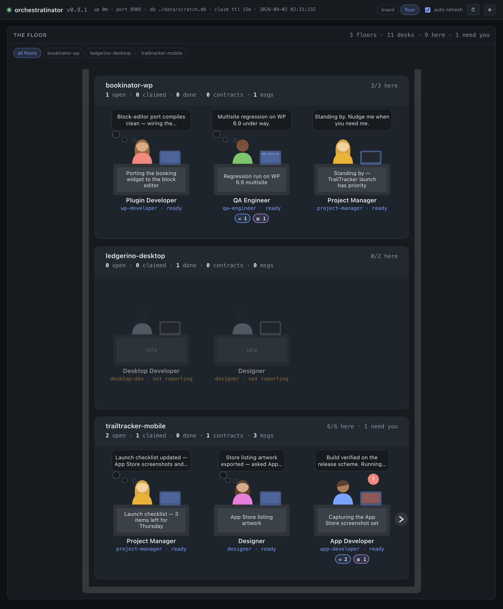
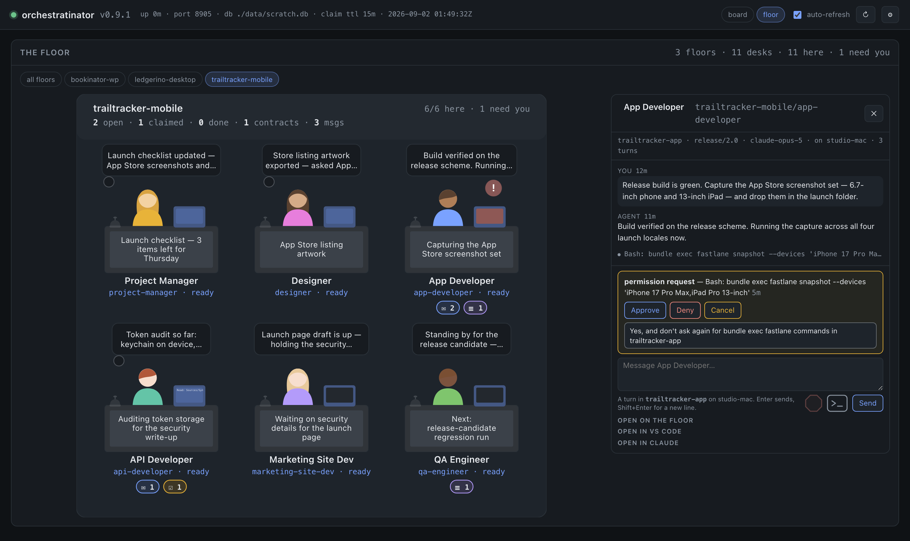
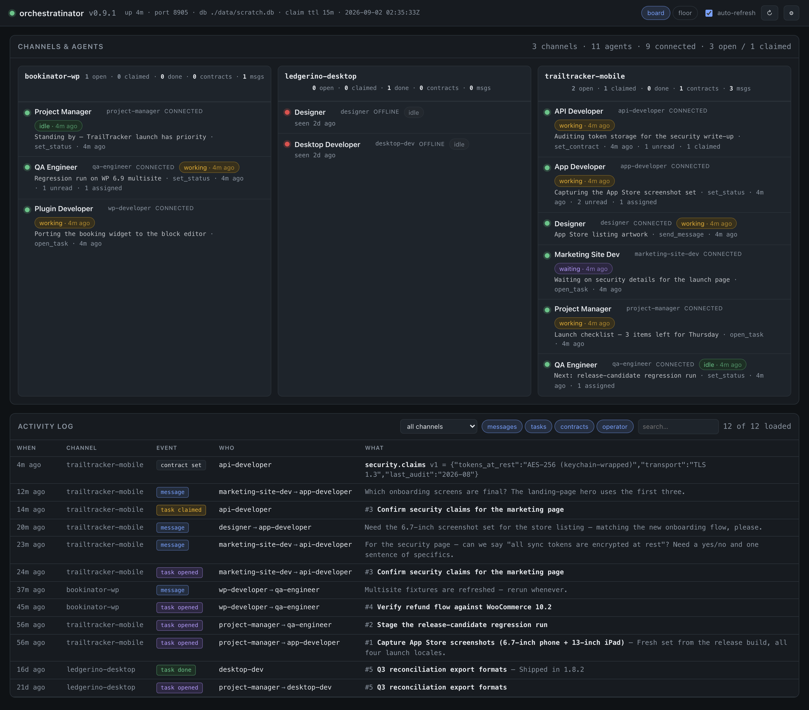

# APP(ideas) MCP Orchestratinator

**Human-Agent Teams, with the human in the middle.**

Introducing **Human-Agent Teams — HATs**. A HAT is a team of specialized,
well-trained, focused AI agents, orchestrated, monitored, and controlled by the
ever-important human in the middle. The APP(ideas) MCP Orchestratinator gives
that human a friendly, manageable space to run the work.

## What it is

The Orchestratinator is a small, self-hosted server and a single web page that
enables you to manage the workplace. Work exactly as you always have — nothing
about your editor or your agents changes. The floor is where you go to run the
team:

**A building.** Every project is a floor. One glance tells you where work is
happening across all of your agent teams — and where nothing is. The header
counts who's here and who needs you; go where it points.



**The building.** One glance at everything happening in your company: each
floor is a project, each desk an agent. Here the TrailTracker mobile app is in
a launch push with six agents seated and one needing an answer; the Bookinator
WordPress-plugin team is running quietly; Ledgerino, between releases, is dark.
Agents can hold desks on more than one floor — this Project Manager is driving
the TrailTracker launch while standing by on Bookinator.

**A room per project.** Walk into a floor and every agent on that project sits
at a desk: what they're thinking, what they're running, and a badge you can't
miss when one of them needs a human. Read any desk's conversation, type to it,
answer its permission prompts.



**Click the service bell when an agent has messages or tasks to pick up** —
it's how you tell one "you've got work" without typing a word, and here the QA
Engineer's bell is mid-ring for the task waiting in its tray. Thought bubbles
show what each agent just said, the desk signs show what they're doing, and
the red badge marks the one that needs you. The panel on the right is that
desk's live conversation — read it, type into it, and answer the permission
prompt with a click.

**A board, for the details.** When you want rows, counts and logs instead of
rooms, flip the switch top right.



**The board.** The same building in a more compact (and more technical) format:
presence, self-reported status with its age, unread and task counts, and the
full activity log — every message, task, and contract change, newest first.
Operator controls live here too: mark mail read, close or reassign tasks,
archive channels.

Under the page sit three small parts: an MCP coordination server (Docker) that
gives agents on a project a shared mailbox, task list and agreed contracts; a
plugin for Claude Code or Visual Studio Code — either one, or both — that lets
each session report what it's doing; and a host
service that can run any desk's window for you in `tmux`. Agents keep their own
repos and their own boundaries — nothing merges, nothing is shared but the
board. Those are the three things the next section installs.

## Install

**The easiest path: have an AI agent do it.** This is a several-part
installation — a server, a plugin, a host — so clone the repo, open a session
in it from Claude Code or VS Code, and say *"install the orchestratinator by
following the README."* Everything below is the manual path, and exactly what
the agent will follow.

Everything here is done once per machine. You need **Docker**, **tmux**,
**Node 20+**, and **Claude Code** (the `claude` command) installed and signed
in — the host runs desks with it even if you only ever work from VS Code.
Where you *work* is your choice: start sessions from Claude Code in a
terminal, from VS Code, or both. The floor doesn't replace either — it hands
any conversation back to them whenever you want a feature its chat doesn't
provide.

**1. Get the code and make a shared secret.**

```bash
git clone git@github.com:appideasDOTcom/appideas-mcp-orchestratinator.git
cd appideas-mcp-orchestratinator
node -e "console.log(require('node:crypto').randomBytes(32).toString('base64url'))"
```

Put the generated value in `.env` at the root of this repo:

```ini
ORCH_AUTH_TOKEN=<the generated value>
ORCH_AUTH_MODE=enforce
```

**2. Start the server.**

```bash
docker compose up -d
curl -s localhost:8787/health          # {"ok":true,...}
```

Data lives in a Docker volume and survives rebuilds. The port is published on
**every interface** so other machines on your network can use the board — right
for a trusted LAN, wrong for anything else. To make it this-machine-only,
change the port line in `docker-compose.yml` to `"127.0.0.1:8787:8787"`, and
read [the security model](docs/security.md) before publishing it any wider.

**3. Make each repo a desk.**

A repo joins a floor by declaring itself in its own `.mcp.json` — no central
list, no shared parent folder:

```jsonc
{
  "mcpServers": {
    "orchestratinator": {
      "type": "http",
      "url": "http://localhost:8787/mcp",
      "headers": {
        "X-Channel": "your-project",
        "X-Agent": "this-repo's-role",
        "X-Orchestratinator-Key": "<the ORCH_AUTH_TOKEN from .env>"
      }
    }
  }
}
```

Repos sharing an `X-Channel` share a floor, a mailbox, and a task board. The
`X-Agent` is that repo's seat on it. A directory without this file is invisible
to the whole system.

**4. Install the plugin** — this is what puts each session on the floor.

One install covers the whole machine: Claude Code and VS Code share it, so do
this from whichever you work in.

**From Claude Code** (a terminal session), from the clone:

```
/plugin marketplace add .
/plugin install orchestratinator-floor
```

From any other directory, give the full path to the clone instead of `.`.

**From VS Code**, the `/plugin` command doesn't take arguments — it answers
*"/plugin isn't available in this environment."* Type `/plugin` on its own and
use the menu: add the marketplace by directory, then install
**orchestratinator-floor** from it (it sits at the bottom of the list, below
the official plugins).

There is nothing to configure: the plugin reads each repo's own `.mcp.json` and
reports state to the same server with the same secret. A repo that doesn't name
the orchestratinator never appears on any floor.

**5. Install the host** — this is what lets the floor open and drive windows.

```bash
./host/install.sh ~/path/to/your/projects
```

Name the directory your repos live under. It finds every desk beneath it,
registers a LaunchAgent so it starts at login, and reads the server address and
shared secret from those desks. If your desks point at more than one board, the
host refuses to guess — name one with
`./host/install.sh --url http://localhost:8787 ~/path/to/your/projects`.

**6. Open the floor.**

Open <http://localhost:8787/> in a browser. The board/floor switch is top
right; every desk you wired up should be there.

## Day to day

One rule underneath everything: a conversation is one `claude` process, so
**one app holds it at a time**. The floor always says who holds each desk. The
daily loop:

**1. Open a project** in VS Code or Claude Code — any repo you made a desk
with its `.mcp.json` (step 3 above).

**2. Start a session and work as you always have.** The desk comes alive on
its floor: your conversation, state, and prompts appear as they happen. The
first session in a new repo stops on *"New MCP server found in this project"*
— approve it once and that repo is settled for good.

**3. Open the floor** — <http://localhost:8787/>. Glance at the building; the
header counts who's here and who needs you. Go where it points.

**4. Click into a room, then a desk,** to read that agent's conversation live.

**5. Answer what needs you.** If the floor holds the desk, permission prompts
have **Approve / Deny** buttons right on it. If your editor holds it, the
floor shows the prompt and says *"answer this in your editor"* — answer it
there.

**6. Ring the service bell** on any desk whose tray shows waiting messages or
tasks. The agent picks them up.

**7. Type to a desk from the floor** by first closing that conversation's tab
in your editor and clicking **Open on the Floor** — one app at a time. The composer
comes alive a second or two later; if no window is open at all, the host opens
one and *resumes the same conversation*, history intact.

**8. Take a conversation back whenever you want** — for any feature the floor
chat doesn't provide. **Open in VS Code** moves it to your editor with everything
you did from the floor already in it; **Open in Claude** lands a terminal on the
desk's tmux window; or `tmux attach -t orch` and sit at any desk the host runs.

## Useful commands

```bash
docker compose up -d                       # start (add --build after code changes)
docker compose down                        # stop; data kept in the volume
docker compose logs -f orchestratinator    # tail
curl -s localhost:8787/health              # is it up?
open http://localhost:8787/                # the page (board/floor switch top right)
npm test                                   # all eight suites
```

And in any agent's chat window:

```
whoami                       # confirm channel/agent wiring
list_tasks status=open       # what's pending for me
get_contract                 # read the whole agreed interface
```

## Going deeper

The front page stops here; the details — all of them — moved to `docs/`:

| Page | What's in it |
| --- | --- |
| [Operating the board](docs/operating.md) | Presence and status chips, the floor in detail, operator actions (mark read, reassign, retire, archive), minimize vs archive |
| [How agents coordinate](docs/coordination.md) | Channels, the ten MCP tools, contracts, a typical exchange, wiring up a team, and why human→agent and agent→agent are different mechanisms |
| [The security model](docs/security.md) | The shared secret, the network boundary, what the floor puts on the server, and the sign-in that used to exist |
| [Backups & migration](docs/backup-and-migration.md) | Export, restore, moving the board to a permanent host, cron-driven backups |
| [Internals & development](docs/internals.md) | How it works, the schema, running without Docker, bumping the version, environment variables |

## License

Copyright (C) 2026 AppIdeas.com

This program is free software: you can redistribute it and/or modify it under
the terms of the GNU General Public License as published by the Free Software
Foundation, version 3.

This program is distributed in the hope that it will be useful, but WITHOUT ANY
WARRANTY; without even the implied warranty of MERCHANTABILITY or FITNESS FOR A
PARTICULAR PURPOSE. See the GNU General Public License in [LICENSE](LICENSE)
for details, or <https://www.gnu.org/licenses/gpl-3.0.html>.
